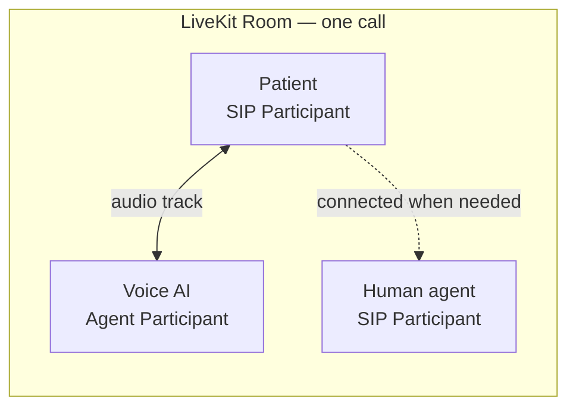
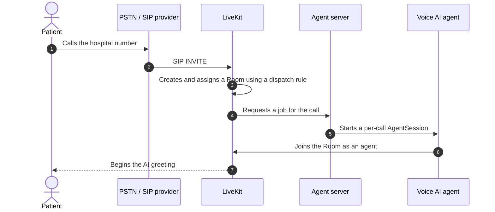
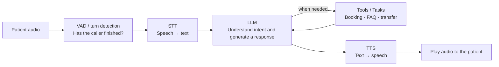
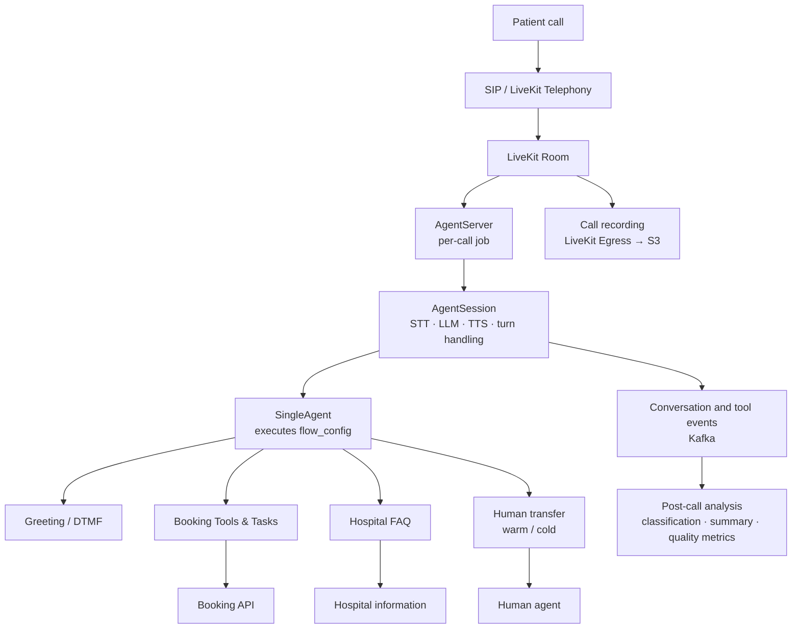

# How Do You Build an AI That Answers the Phone? A Hospital Inbound Voice AI Built with LiveKit Agents

*By Dan · August 6, 2026*


## 1. Not a Chatbot, but an AI That Answers the Phone

In a text chat, waiting a few seconds for a reply rarely feels unusual. A phone call is different. If callers hear nothing after they finish speaking, they may assume the connection has dropped. If they interrupt to correct something and the agent keeps talking, they immediately feel that the conversation is not working.

For a phone agent, audio is not merely an input and output format. **Latency, silence, interruptions, connection state, and call termination are all part of the conversation experience.**

We are building an inbound voice AI that answers calls to hospitals and handles tasks such as:

- Playing an initial greeting and recording disclosure
- Routing requests through speech or DTMF keypad input
- Checking available appointment slots and creating bookings
- Looking up, rescheduling, or canceling existing appointments
- Answering questions about opening hours and other frequently requested information
- Transferring the call to a human agent when necessary
- Sending recordings and conversation events to a post-call analysis system

**LiveKit** provides the real-time communications foundation for this service. **LiveKit Agents** is the framework that connects the AI's ability to listen, reason, act, and speak on top of that foundation.

> **TL;DR**
>
> - **LiveKit** provides the real-time space through which audio, video, and data flow.
> - **LiveKit Agents** lets an AI program join that space, listen to the caller, respond, and invoke tools.
> - A phone caller enters a LiveKit Room through SIP, and the AI agent joins the same Room.
> - On top of this model, we added appointment workflows, FAQs, DTMF, human transfer, call recording, and post-call analysis.
> - In production, quality depends on more than the LLM. Turn detection, interruptions, latency, and shutdown behavior matter just as much.

---

## 2. What Is LiveKit?

LiveKit is an open-source framework and cloud platform for building applications that exchange audio, video, and data in real time. Under the hood, it handles difficult infrastructure problems such as WebRTC media transport and routing, session management, and adaptation to changing network conditions.

Video conferencing is the easiest comparison, but LiveKit is not limited to meetings. The same communication model can support browser and mobile applications, phone services connected to the public telephone network, and real-time AI assistants.

Three concepts are especially important when learning LiveKit: `Room`, `Participant`, and `Track`.

| Concept | Meaning | Example in a hospital phone agent |
|---|---|---|
| `Room` | A session in which real-time communication takes place | One patient's phone call |
| `Participant` | A person or program connected to a Room | Patient, voice AI, or human agent |
| `Track` | A media stream published or subscribed to by a Participant | The patient's audio or synthesized AI speech |

LiveKit describes a Room as a virtual space for real-time communication, a Participant as an entity such as a user, AI agent, or SIP caller, and a Track as an audio, video, or data stream. The value of this model is that it does not treat the telephone user and the AI as entirely different kinds of systems. Instead, both become **participants in the same real-time environment**.



A typical HTTP interaction ends after one request and one response. A voice call is continuous: audio keeps flowing, while participant and connection states change throughout the session. LiveKit exposes that live media and session state through abstractions that application code can manage.

Further reading: [About LiveKit](https://docs.livekit.io/intro/about/) and [Rooms, participants, and tracks](https://docs.livekit.io/intro/basics/rooms-participants-tracks/)

---

## 3. How Are LiveKit and LiveKit Agents Different?

The names are similar, but their responsibilities are different.

**LiveKit** provides the communication space and connections. **LiveKit Agents** is an application framework for building an AI that can converse and perform work inside that space.

| LiveKit | LiveKit Agents |
|---|---|
| Manages Rooms and Participants | Manages AI agents and `AgentSession` |
| Transports real-time audio, video, and data | Connects STT, LLM, and TTS pipelines |
| Handles WebRTC connections and network changes | Detects speech boundaries and conversation turns |
| Connects SIP callers to Rooms | Controls interruptions and AI audio playout |
| Publishes and subscribes to media Tracks | Handles tool calls, state, and conversation logic |
| Provides recording and session events | Runs an agent server and per-call jobs |

A simple analogy is that LiveKit is **the call room where the connection and audio exist**, while LiveKit Agents is **the AI representative who enters that room, listens to the caller, and carries out the requested task**.

A Python or Node.js program built with LiveKit Agents can join a Room as a Participant. The agent receives user audio, processes it with AI models, and publishes synthesized audio back to the Room. The framework also provides capabilities that voice applications repeatedly need: STT, LLM and TTS integration, turn detection, interruption handling, tool calling, and agent lifecycle management.

Further reading: [Introduction to LiveKit Agents](https://docs.livekit.io/agents/)

---

## 4. How Does a Regular Phone Call Reach the AI?

A patient calling a hospital does not open a browser or install a LiveKit app. They simply dial the hospital's phone number. **SIP, or Session Initiation Protocol**, is the bridge that brings that call into a LiveKit Room.

SIP is a standard protocol used to initiate, manage, and end internet-based calls. A call from the public switched telephone network, or PSTN, reaches a LiveKit SIP endpoint through a carrier or SIP trunk provider.



In LiveKit, an inbound trunk defines which calls to accept, while a dispatch rule decides which Room and agent should handle an incoming call. Once connected, the caller appears as a `SIP Participant`. When the AI agent joins the same Room, their audio can flow in both directions in real time.

This model keeps the agent's business logic from becoming tightly coupled to the caller's access channel. Whether a user arrived through the telephone network or a microphone in a web application, LiveKit normalizes the communication layer. The agent can focus on the audio and state it receives inside the Room.

Further reading: [SIP primer](https://docs.livekit.io/reference/telephony/sip-primer/) and [Accepting calls](https://docs.livekit.io/telephony/accepting-calls/)

---

## 5. How Does the AI Listen, Think, and Speak?

It is easy to imagine one model listening to audio and replying directly with audio. Speech-to-speech real-time models can work that way, but our current architecture centers on a modular **STT–LLM–TTS pipeline**.



### STT: Converting the Patient's Speech into Text

The speech-to-text model receives the patient's audio from the Room as a live stream and turns it into text. Telephone audio may include background noise, quiet speech, proper nouns, hospital names, and physician names. Accuracy matters, but so do streaming performance and language-specific quality.

### LLM: Understanding the Conversation and Choosing the Next Action

The LLM generates a response from the transcript, conversation history, and hospital configuration. In a production service, however, its role is not limited to writing sentences. For an appointment request, it must invoke a booking tool. For a hospital information question, it should answer only from the approved FAQ. When human judgment is required, it must enter the transfer workflow.

### Tools and Tasks: Where Words Become Verifiable Work

Saying “I can book that for you” and successfully creating an appointment through an API are completely different things. Tools and Tasks connect the LLM's intent to concrete, verifiable operations.

A booking workflow might proceed as follows:

1. Collect the desired department, physician, date, and time constraints.
2. Query the booking API for slots that are actually available.
3. Present only valid options to the patient.
4. Create the appointment after receiving final confirmation.
5. Record the API result as a conversation event.

### TTS: Turning Text into Speech That Works on a Call

The text-to-speech model converts generated responses and predefined prompts into audio. For phone service, naturalness is only one quality dimension. We also care about how quickly the first audio begins, whether dates and times are pronounced correctly, and whether playback can stop immediately when the caller interrupts.

A modular pipeline lets us select each model independently, retain transcripts and tool-call records, and trace latency or errors to a specific stage. The tradeoff is that delays can accumulate across stages, so streaming and techniques such as preemptive generation become important.

Further reading: [Voice pipeline types](https://docs.livekit.io/agents/models/pipelines/)

---

## 6. The Hospital Inbound Voice AI We Built

In our service, LiveKit is the communication layer that connects the patient and the AI in real time. The business layer above it executes a call flow based on the hospital's configuration and the caller's request.

The current runtime centers on `AgentServer`, `AgentSession`, and `SingleAgent`.

- `AgentServer` stays registered with LiveKit, waits for call requests, and starts a job for each call.
- `AgentSession` combines STT, LLM, TTS, VAD, turn detection, and interruption settings into one real-time conversation session.
- `SingleAgent` follows the hospital's `flow_config`, executes prompts and conditional branches, and runs the Tools and Tasks needed for booking, FAQ responses, and human transfer.



### Hospital-Specific Call Flows Are Controlled by Configuration

Hospitals do not all answer calls in the same way. One may begin with a DTMF menu such as “Press 1 for appointments,” while another may want the caller to speak immediately. Transfer policies may differ during and outside business hours. Appointment and information workflows also vary.

Hard-coding every variation would require a deployment whenever a hospital is added or a policy changes. We therefore define the high-level call flow in `flow_config`.

A `flow_config` can contain nodes such as:

- `greeting`: Plays an announcement and optionally collects DTMF input.
- `condition`: Chooses the next path from business hours or session values.
- `agent`: Enters a section where the AI handles open-ended conversation.
- `action`: Performs an operation such as transferring a call or recording an event.
- `exit`: Plays a closing message and shuts down the session safely.

This separation lets configuration control **what should happen and in what order**, while the LLM and agent decide **how to understand and respond to the caller's natural language**.

### Combining DTMF with Open-Ended Conversation

A voice AI does not need to accept every input through speech. DTMF remains useful for information that demands exact input, such as identity-verification digits, menu choices, or replay requests. Open-ended conversation is much more natural for a request such as, “I'd like an orthopedics appointment next Monday afternoon.”

We do not treat the two interaction styles as competitors:

- Deterministic steps use DTMF and explicit conditional branches.
- Language-heavy steps use LLM-based conversation and tool calls.

The caller keeps a familiar telephone experience without having to navigate a deep menu tree for a complex request.

### Processing Continues After the Call Ends

The real-time agent's job ends with the call, but the service's work does not. Depending on configuration, LiveKit Egress stores a recording, while the session publishes conversation messages and tool execution events to Kafka. A downstream pipeline classifies and summarizes the call and derives metrics such as booking conversion, transfer outcomes, and recurring error patterns.

This separation has an important benefit: the real-time path can prioritize responsiveness, while expensive or time-consuming analysis runs asynchronously after the call.

---

## 7. The Hardest Voice AI Problems Often Live Outside the LLM

Connecting a strong language model does not automatically produce a good phone service. Much of our engineering work has gone into conversation boundaries and asynchronous state.

### How Do We Know That the Caller Has Finished Speaking?

Basic voice activity detection can tell whether sound is present, but it cannot understand whether a sentence is complete. If a patient says, “Next week... one moment... Wednesday,” treating the middle pause as the end of the turn causes the AI to answer too early.

Turn detection and endpointing in LiveKit Agents combine speech activity, context, and timing to estimate the end of a user's turn. We tune minimum and maximum endpointing delays and the turn detector to balance two competing goals: do not interrupt too eagerly, but do not leave the caller in a long silence.

Further reading: [Turn detection](https://docs.livekit.io/agents/logic/turns/turn-detector/)

### Interruption Handling Is a Conversation Policy, Not Just a Feature

People do not always wait for the other person to finish. A caller may correct the AI midway through a response: “No, not the morning—the afternoon.” The agent must stop the current audio and process the new request.

But treating every acknowledgment, cough, or background sound as an interruption makes the AI stop constantly. We therefore need policies for minimum speech duration, minimum word count, and recovery from false interruptions. Critical messages, such as recording disclosures and final booking confirmations, may require different interruption rules from ordinary conversation.

Further reading: [Turns and interruptions](https://docs.livekit.io/agents/logic/turns/)

### Latency Accumulates Across the Pipeline

Several operations occur between the end of the caller's speech and the beginning of the AI's reply:

```text
end-of-turn decision + final STT + first LLM token + Tool/API + first TTS audio
```

Even if no individual stage is extremely slow, the total delay can become noticeable. We measure each stage separately, use streaming TTS and preemptive generation, and preload models and data that can be prepared before the call. When an external API takes time, a short progress message is sometimes better than unexplained silence.

### A Call Does Not End as a Single Event

When a caller hangs up, several tasks may still be running: AI audio playout, a booking API call, recording finalization, Room cleanup, and Kafka publication. These are separate asynchronous operations.

If shutdown is too slow, workers remain occupied unnecessarily. If it is too aggressive, the service may lose the final audio or analysis events. We therefore define the ordering and idempotency of caller disconnect, `AgentSession` shutdown, recording completion, and downstream event publication explicitly.

### Human Transfer Is a Distributed State Problem Involving Multiple Participants

In a cold transfer, the call moves to a human and the AI leaves. In a warm transfer, the AI may first connect to the human, share context, and manage the intermediate state until the patient and human agent are safely connected.

During a warm transfer, the patient, AI, and human agent can each occupy a different state within the same call. The system must control who can hear whom, decide how to recover from a failed connection, and prevent overlapping transfer attempts. In practice, the state machine and concurrency control matter more than simply forwarding a phone number.

---

## 8. Why LiveKit Fit—and What It Does Not Solve for Us

LiveKit and LiveKit Agents provide a relatively consistent model from real-time communications through the AI conversation pipeline. Several characteristics fit our service especially well.

### What Worked Well

- **The model connecting telephony and AI is clear.** Patients, AI agents, and human agents can all be represented as Participants.
- **The existing phone network remains intact.** Patients call the hospital's usual number without installing a new application.
- **AI models are composable.** We can choose and replace STT, LLM, and TTS providers for the language and use case.
- **It integrates naturally with Python business logic.** Booking APIs, hospital configuration, Tools, and Tasks can live alongside the agent code.
- **Real-time conversation primitives are included.** We do not have to build turn detection, interruption handling, audio playout, and transcription from scratch.
- **Each call has an isolated execution unit.** The agent server runs each call as a separate job, which helps contain state and failures.

After registering with LiveKit, an agent server waits for dispatch requests. When one arrives, it starts a job for that call. A server can handle multiple jobs while running them in separate processes, which provides useful isolation between calls.

Further reading: [Agent server lifecycle](https://docs.livekit.io/agents/server/lifecycle/)

### What We Still Have to Solve Ourselves

- Evaluate which combination of STT, LLM, and TTS performs best for Korean telephone audio.
- Balance model accuracy, latency, and cost for each service.
- Reliably handle domain expressions such as hospital names, departments, physicians, dates, and times.
- Test the complete path, including the telephone network and SIP provider.
- Add explicit validation and confirmation before irreversible operations such as final booking or human transfer.
- Design service-level security, privacy, and retention policies for recordings and personal data.

LiveKit is a strong foundation for real-time communication and agent execution, but it is not a finished product that automatically guarantees the accuracy and safety of hospital workflows. A reliable voice AI emerges only when communications infrastructure, AI models, business rules, and operational observability work together.

---

## 9. Closing Thoughts: Treating AI as a Participant in a Live Call

One of the most useful ideas we gained from LiveKit is to think of the AI not as a simple API, but as **a Participant in a real-time call**.

The patient and AI enter the same Room and exchange audio through Tracks. LiveKit Agents connects listening, turn detection, response generation, speech playout, and tool execution on top of that media layer. Our business logic then combines appointment workflows, hospital information, DTMF, human transfer, recording, and post-call analysis so that the agent can safely perform real hospital work.

The quality of an AI phone agent cannot be explained by the choice of LLM alone. The service must recognize when the caller has finished, stop speaking when appropriate, offer only appointments that are actually available, and preserve critical data when the call disconnects.

LiveKit provides the real-time communications foundation for that complex process. LiveKit Agents turns the AI into a conversational participant on top of it. We add hospital-specific workflows and operating policies to build something beyond an AI that answers questions: **a voice AI that answers the phone and completes real tasks**.

In the next article, we will look more closely at how we combine open-ended LLM conversation with deterministic call control through a `flow_config`-driven architecture.

---

## References

- [LiveKit: About LiveKit](https://docs.livekit.io/intro/about/)
- [LiveKit: Rooms, participants, and tracks](https://docs.livekit.io/intro/basics/rooms-participants-tracks/)
- [LiveKit Agents: Introduction](https://docs.livekit.io/agents/)
- [LiveKit Telephony: SIP primer](https://docs.livekit.io/reference/telephony/sip-primer/)
- [LiveKit Telephony: Accepting calls](https://docs.livekit.io/telephony/accepting-calls/)
- [LiveKit Agents: Pipeline types](https://docs.livekit.io/agents/models/pipelines/)
- [LiveKit Agents: Turn detector](https://docs.livekit.io/agents/logic/turns/turn-detector/)
- [LiveKit Agents: Turns and interruptions](https://docs.livekit.io/agents/logic/turns/)
- [LiveKit Agents: Server lifecycle](https://docs.livekit.io/agents/server/lifecycle/)
